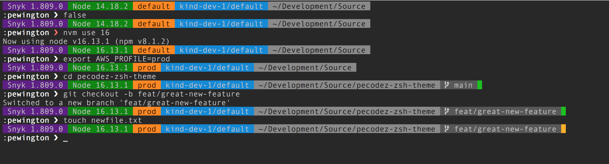

# pecodez-zsh-theme
A ZSH theme optimised for dark terminal themes that use

- Snyk
- Node
- AWS
- Kubernetes
- Git
- Unicode fonts and compatible terminal I.E iTerm2

## Reasoning
I like to know what version of software I am running, especially `snyk` and `node`, the `AWS` profile or `k8s` context I am currently in and the status of `git` branches I am working on. I wanted a command prompt that showed me all this while leaving the inout line uncluttered, so I created this multi-line theme.

# What does it show
A multi-line prompt...

First line (segments):
- Snyk version
- Node version
- AWS profile
- Kubernetes context
- Git Info
    - Branch name
    - Colour indicator to show clean/dirty status

Second Line:
- username
- User input prompt
    - Renders prompt error in red when last command returns a non zero status

